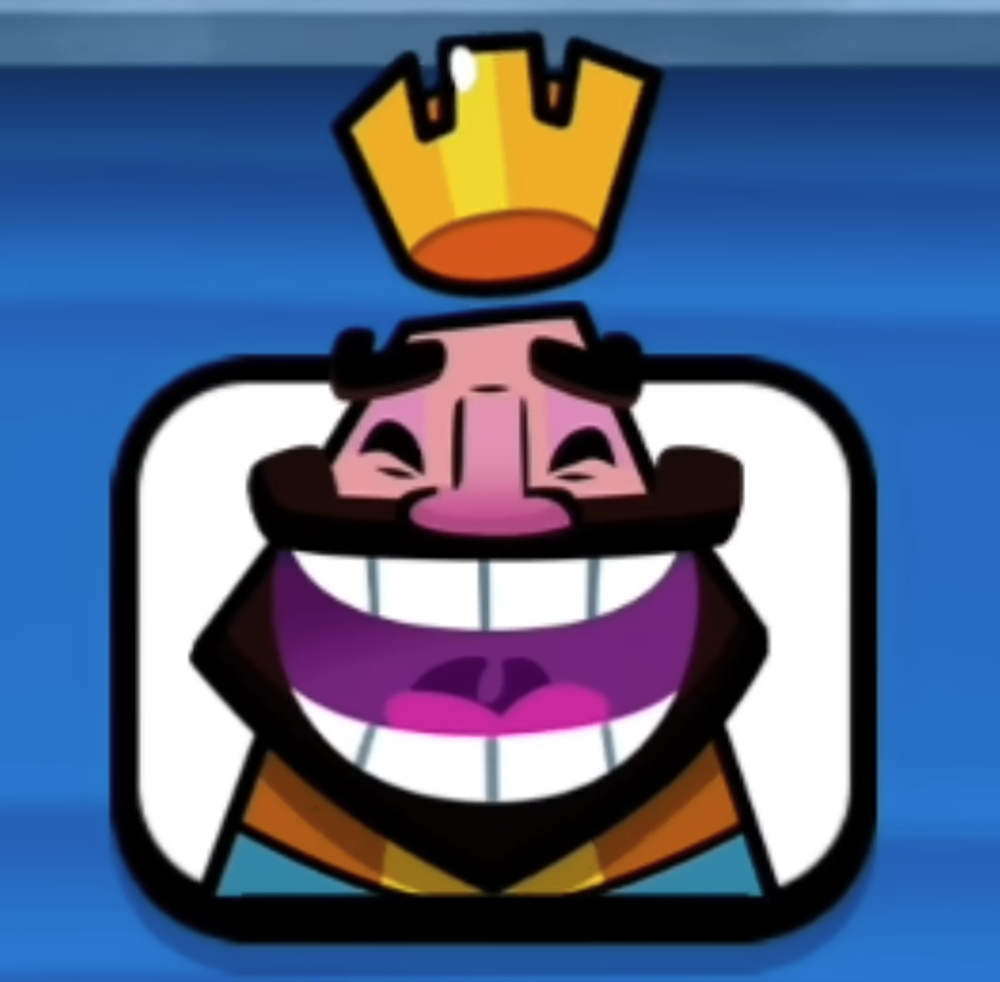

# Clash Royale Emote Detector

A pose classifier for Clash Royale emotes built using MediaPipe for landmark detection and scikit-learn for machine learning classification.

 

## Features

- **Pose Detection**: Full body pose with 33 landmarks
- **Face Detection**: 468 facial landmarks
- **Hand Detection**: Left and right hand with 21 landmarks each
- **Pose Classification**: ML model (RandomForest) to classify poses
- **Real-time Processing**: Live webcam feed processing with pose prediction
- **Data Collection**: Tool to collect training data for custom poses
- **Visualization**: Colored landmarks and connections with pose labels
- **Screenshot Capture**: Save detection results

## Installation

1. Install dependencies:
```bash
pip install -r requirements.txt
```

## Usage

### Quick Start

1. **Run the detector with the pre-trained model**:
```bash
python main.py
```

### Controls

- **'q'**: Quit the application
- **'s'**: Save a screenshot of the current detection
- **'t'**: Retrain the model with sample data

### Data Collection

To collect your own training data:
```bash
python data_collector.py
```

## Files

- `holistic_detector.py`: Core detector class with MediaPipe integration
- `pose_classifier.py`: ML model for pose classification using Random Forest
- `data_collector.py`: Tool for collecting training data and model training
- `main.py`: Main application script with pose classification
- `requirements.txt`: Python dependencies

## Pose Classes

The model can classify the following poses:

| Emote | Description | Reference |
|-------|-------------|-----------|
| **Laughing** | Hands on waist, mouth wide open |  |
| **Yawning** | Hands over mouth |  |
| **Crying** | Hands covering face |  |
| **Taunting** | Balled fists close to face |  |

**Note**: You can adjust the code to add more emotes, but you'll need to retrain the model. The included pre-trained model only classifies the poses above. Add images and sounds as desired.

## Requirements

- Python 3.7+
- OpenCV 4.8+
- MediaPipe 0.10+
- NumPy 1.24+
- scikit-learn 1.3+